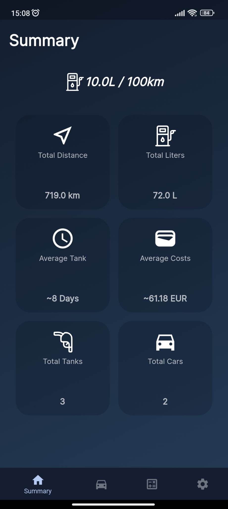
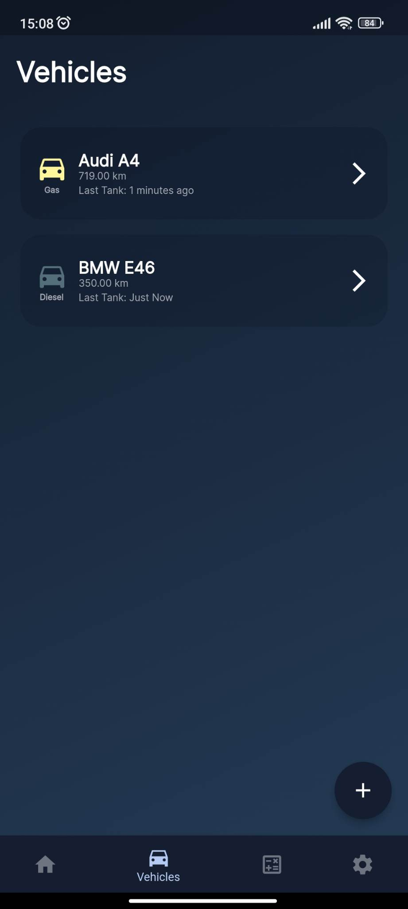
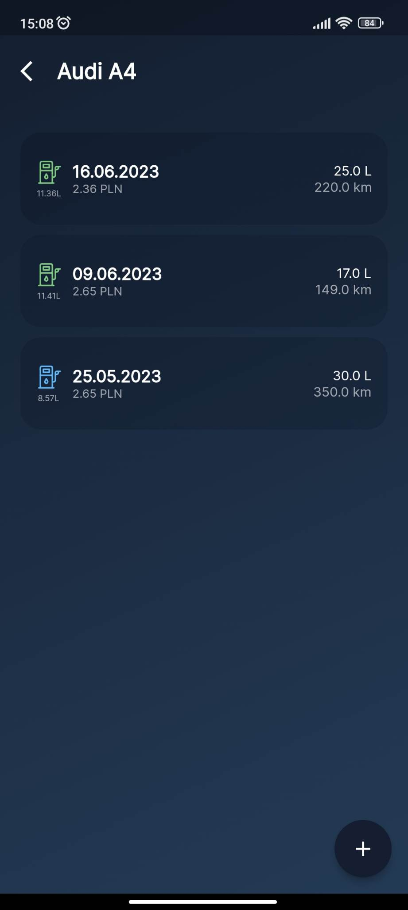
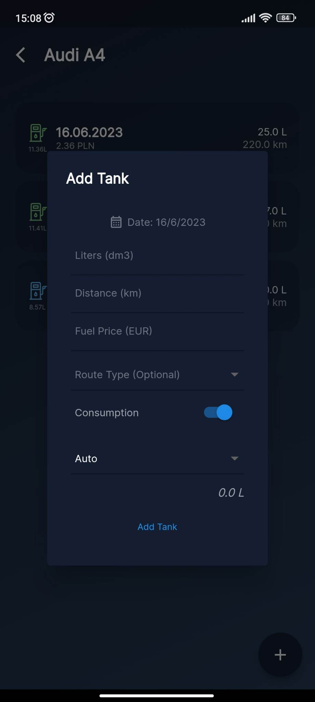
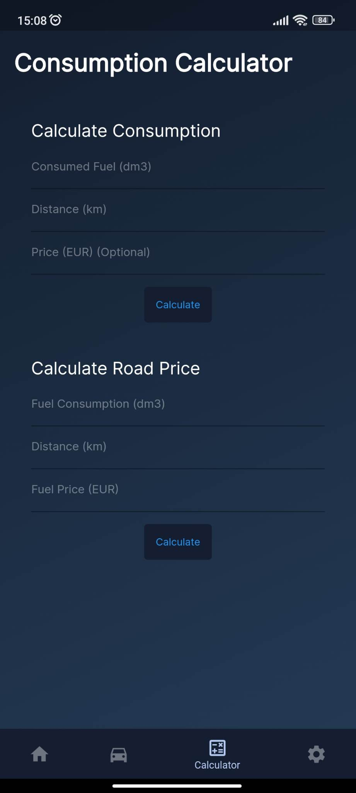
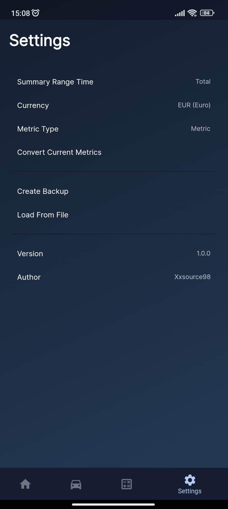

  

# 
FUsage

## About
FUSage is a mobile app coded in Dart using Flutter Framework. I made that app, because I wanted to write my fuel statistics every tank.

As you can see, there is a Windows folder when it is a mobile app. That because I used Windows for most tests. So I can say that the app is working on Windows and mobile devices.

## Functions
<ul>
    <li><b>Add multiple cars</b></li>
    <li><b>Add tanks for each car</b></li>
    <li><b>Display tank summary (average tank time, average price etc.) with changeable range time</b></li>
    <li><b>Calculate Fuel Consumption in your car</b></li>
    <li><b>Export and Load saved settings</b></li>
</ul>

## Images

  
  
  
  
  
  
  

## License
Project is under GNU General Public License v3.0. You can read more there: www.gnu.org
